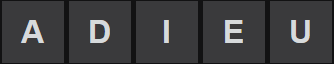
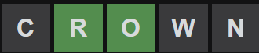

# wordle-solver

This is just a personal project to teach myself some basic python concepts. It is a very boring brute-force 
algorithm, similar to the one behind the impossible hangman game. The only optimization in terms of guessing
the word quicker is prioritizing words with unique letters in order to guess more unguessed letters, 
and prioritizing words that have letters with higher density scores.

### How to Use

You can start with any word but I have included two suggestions that contain multiple vowels. The script will
then prompt you for wordle output. This is a 5 letter string that gives information on what letters are in the word,
what letters arent, and what letters are in the correct position.

Here are some wordle outputs with screenshots of the wordle screen.

#### Key: b = black, c = correct, y = yellow

`bbbbb`

`ybcbb`

`bccbbb`

Upon successfull word guess, input `ccccc` and the script will tell you how many tries it took. Feel free to pr
or submit issues!